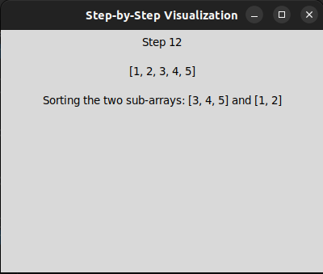

# Sorting Algorithm Visualizer

This is a Python application that visualizes various sorting algorithms step by step using a graphical user interface (GUI). It allows users to select an algorithm, input a vector to be sorted, and observe the sorting process visually.

## Features

- Supports the visualization of the following sorting algorithms:
  - Bubble Sort
  - Insertion Sort
  - Selection Sort
  - Merge Sort
- Step-by-step visualization of the sorting process.
- Graphical representation of the current state of the vector being sorted.
- Additional textual information for each step of the sorting process.
- Customizable sleep times for different algorithms to control the speed of visualization.

## Installation

1. Clone the repository:

    ```
    git clone https://github.com/your-username/sorting-algorithm-visualizer.git
    ```

2. Navigate to the project directory:

    ```
    cd algo-visualizer-tkinter
    ```

## Usage

1. Run the application:

    ```
    python main.py
    ```

2. Select an algorithm from the dropdown menu.
3. Enter a comma-separated vector in the input field.
4. Click the "Sort" button to start the visualization.

## Screenshots


*Bubble Sort Visualization*


*Bubble Sort Visualization*


*Merge Sort Visualization*


*Merge Sort Visualization*

## Contributing

Contributions are welcome! If you have suggestions for improvements or new features, please open an issue or submit a pull request.

## License

This project is licensed under the [MIT License](LICENSE).
